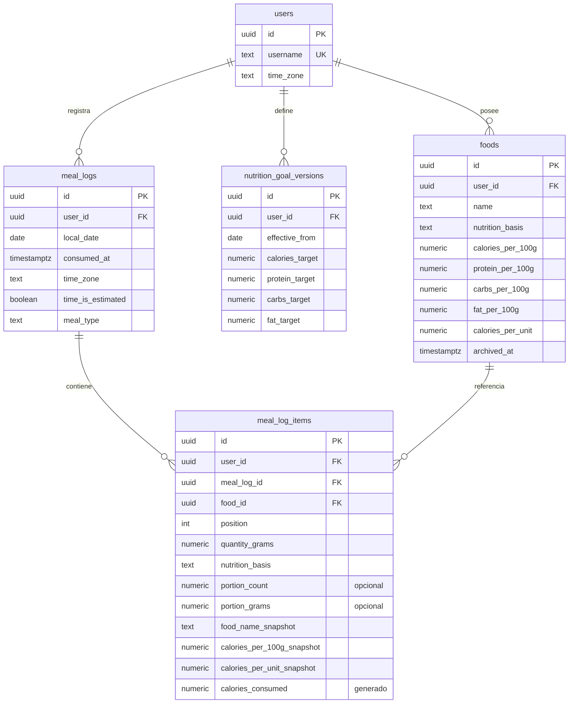
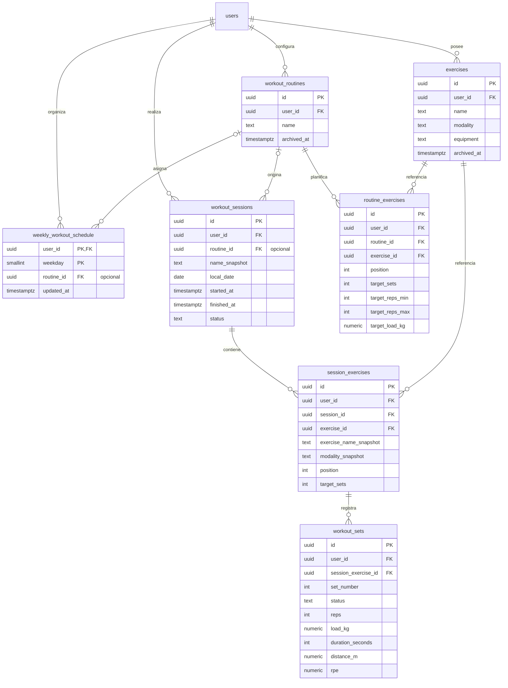

# Esquema de Fitness

**PostgreSQL 17 · Implementado mediante migraciones 0001–0008.**

El modelo tiene 14 tablas activas, vistas de consumo, claves foráneas, restricciones, índices
y actualización automática de `updated_at`. El [DDL de referencia](schema.sql) describe el modelo
para una base vacía. La fuente de instalación y actualización es la carpeta `migrations/`.

Las migraciones se han aplicado al PostgreSQL local mediante SQLx. El backend utiliza las nuevas
tablas nutricionales. Las tres tablas anteriores se conservan en el esquema `legacy`, y la vista
`consumption_entries` unifica ingestas antiguas y nuevas. Las rutinas y su planificación semanal
tienen casos de uso y rutas, junto al registro diario de sesiones, series y consumo de agua.

Consulta el [procedimiento de migración](migrations.md), las decisiones de compatibilidad y las
comprobaciones realizadas. La Raspberry no se ha conectado ni actualizado en esta sesión.

## Alcance y convenciones

- Una base relacional para usuarios, nutrición y entrenamientos.
- Los alimentos, ejercicios y rutinas pertenecen inicialmente a un usuario. Un catálogo global
  podrá añadirse después con reglas explícitas de acceso y copia.
- UUID como identificador. La aplicación puede proporcionarlo; PostgreSQL también ofrece un valor por defecto.
- Cantidades y nutrientes en `NUMERIC`, con hasta tres decimales en entradas y ocho en consumos derivados.
  La multiplicación por `0.01` calcula gramos × valor por 100 g sin redondeos intermedios adicionales.
- Los campos de cantidad, nutrientes y carga excluyen negativos y valores no finitos.
- Instantes en `TIMESTAMPTZ`; día del diario en `DATE`; zona horaria conservada en cada registro.
- La API obtiene `user_id` del token y filtra las consultas por ese usuario.

## 1. Nutrición



Los diagramas muestran los campos principales. `schema.sql` contiene todas las columnas, incluidos
los tres macros copiados y sus totales generados. Las cabeceras pueden estar vacías durante una
transacción; el caso de uso debe exigir al menos un alimento al confirmar una comida.

### Catálogo, comidas e ingestas

| Tabla | Ejemplo | Responsabilidad |
| --- | --- | --- |
| `foods` | Arroz cocido: nutrientes por 100 g | Catálogo editable |
| `meal_logs` | Almuerzo del 29 de septiembre | Agrupa alimentos consumidos en una ocasión |
| `meal_log_items` | 150 g de arroz en ese almuerzo | Cantidad, valores utilizados y consumo resultante |
| `nutrition_goal_versions` | Objetivos vigentes desde el 1 de octubre | Historial de metas por usuario |

Al registrar una ingesta, el backend consulta un alimento propio y activo, copia su nombre y valores
por 100 g y guarda los gramos. Los cuatro totales son columnas generadas por PostgreSQL a partir de
esa misma fila. El cliente no controla los nutrientes de la ingesta.

También puede indicar porciones: `portion_count = 2` y `portion_grams = 29` guardan 58 g.
Se conservan ambas cantidades en el registro para mostrarlas y editarlas después. Admiten tres
decimales y el peso total se redondea a 0.001 g. Las restricciones exigen ambas propiedades juntas
y que su producto redondeado coincida con los gramos. Las entradas por gramos mantienen ambas a NULL.

Con `nutrition_basis = 'per_unit'`, el catálogo conserva nutrientes `*_per_unit` y sus valores por
100 g son NULL. La ingesta copia esa base y los nutrientes de una unidad; guarda `portion_count`,
dejando `quantity_grams` y `portion_grams` a NULL. El total generado es unidades × valor por unidad.
Así, un batido puede consumirse como una unidad sin conocer su peso. La restricción de cada fila
impide mezclar nutrientes y cantidades de ambas bases. Las ediciones del catálogo no cambian
la base ni los nutrientes de snapshots anteriores.

Editar el catálogo conserva los valores copiados en las comidas anteriores. Editar únicamente la
cantidad de una ingesta conserva su copia nutricional y recalcula sus totales. La edición actual
permite corregir cantidades, porciones y fecha. Cambiar la fecha mueve solo esa ingesta y conserva
su zona horaria; el nuevo instante se marca como estimado. Sustituir el alimento requerirá una
operación explícita posterior que vuelva a obtener sus valores desde el catálogo.

La cabecera y sus alimentos se crean en una transacción. Borrar una cabecera elimina sus elementos.
Un alimento que ya tenga referencias se archiva con `archived_at`; su borrado físico está restringido
por las claves foráneas. Las consultas de histórico utilizan los valores copiados y no excluyen las
ingestas cuyo alimento esté archivado.

### Objetivos por fecha

`UNIQUE (user_id, effective_from)` admite una versión por fecha de inicio. La versión vigente para
un día es la última cuya fecha sea menor o igual a ese día. No hace falta un `effective_until` que
pueda desajustarse respecto a la versión siguiente.

- El caso de uso crea una versión al configurar los primeros objetivos.
- El endpoint actual guarda los cambios en la fecha local actual del usuario. Varias correcciones
  del mismo día actualizan esa versión; las versiones de días anteriores se conservan.
- Programar objetivos para una fecha futura requiere un caso de uso posterior.
- Las versiones históricas se tratan como inmutables desde la aplicación. La tabla por sí sola no
  prohíbe actualizarlas o insertar versiones retroactivas: esas operaciones requieren un flujo
  explícito de corrección y, en producción, permisos apropiados del rol de escritura.
- `calories_target` expresa la meta; `tdee_estimate` y `bmr_estimate` son estimaciones opcionales.
- La consulta SQL de referencia devuelve objetivos y saldos `NULL` si no encuentra una versión.
  Por compatibilidad, el endpoint diario actual conserva su cálculo estimado desde el perfil para
  ese caso. Esa estimación no representa un objetivo histórico registrado. Un contrato futuro
  podrá exponer explícitamente la ausencia de objetivos y la procedencia de las estimaciones.

### Resumen diario y macros restantes

La vista `daily_nutrition_totals` suma ingestas nuevas y antiguas mediante `consumption_entries`.
Solo cuenta comidas que tienen ingestas. El saldo se calcula al consultar y puede ser negativo
si se supera la meta. Un día sin comidas se devuelve con consumos a cero.

Esta consulta de referencia usa parámetros del backend: `$1` es el usuario autenticado y `$2` el día.

```sql
WITH requested_day AS (
    SELECT $1::UUID AS user_id, $2::DATE AS local_date
)
SELECT
    d.local_date,
    g.id AS goal_version_id,
    g.calories_target,
    g.protein_target,
    g.carbs_target,
    g.fat_target,
    COALESCE(t.calories_consumed, 0) AS calories_consumed,
    COALESCE(t.protein_consumed, 0) AS protein_consumed,
    COALESCE(t.carbs_consumed, 0) AS carbs_consumed,
    COALESCE(t.fat_consumed, 0) AS fat_consumed,
    g.calories_target - COALESCE(t.calories_consumed, 0) AS calories_remaining,
    g.protein_target - COALESCE(t.protein_consumed, 0) AS protein_remaining,
    g.carbs_target - COALESCE(t.carbs_consumed, 0) AS carbs_remaining,
    g.fat_target - COALESCE(t.fat_consumed, 0) AS fat_remaining
FROM requested_day d
LEFT JOIN daily_nutrition_totals t
    ON t.user_id = d.user_id AND t.local_date = d.local_date
LEFT JOIN LATERAL (
    SELECT v.* FROM nutrition_goal_versions v
    WHERE v.user_id = d.user_id AND v.effective_from <= d.local_date
    ORDER BY v.effective_from DESC
    LIMIT 1
) g ON TRUE;
```

## 2. Entrenamientos



| Tabla | Responsabilidad |
| --- | --- |
| `exercises` | Catálogo privado de ejercicios de fuerza, cardio o movilidad |
| `workout_routines` | Una rutina reutilizable, por ejemplo «Día A» |
| `weekly_workout_schedule` | Asignación recurrente: una rutina propia opcional por día ISO (1 lunes–7 domingo) |
| `routine_exercises` | Orden, series, rango de repeticiones, carga, duración, distancia y descansos previstos |
| `workout_sessions` | Una ejecución concreta; puede ser libre, sin rutina |
| `session_exercises` | Copia del nombre, modalidad y prescripción de cada ejercicio al iniciar la sesión |
| `workout_sets` | Series reales: pendientes, completadas u omitidas |

La API guarda la semana completa en una transacción. Una rutina puede repetirse varios días.
La ausencia de fila o `routine_id = NULL` significa descanso o día sin planificar. Archivar una
rutina deja sus asignaciones a `NULL` en la misma transacción. La clave foránea compuesta impide
asignar rutinas ajenas. El plan representa la semana actual recurrente y no guarda versiones
históricas; la home consulta su asignación para el día de la semana de la fecha seleccionada.

Al iniciar una sesión desde una rutina, una transacción copia su nombre y la prescripción a las
tablas de sesión y crea sus series pendientes. Las ediciones posteriores de la
rutina no alteran esa copia. Este primer diseño prescribe el mismo rango/carga para las series
de un ejercicio; una prescripción distinta para cada serie puede añadirse después con una tabla específica.

Ejemplo: la rutina propone sentadilla `3 × 8–10`; la sesión registra tres series de `10 × 40 kg`,
`10 × 40 kg` y `8 × 45 kg`. Para cardio pueden registrarse duración y distancia. `NULL` significa
que una métrica no aplica o no se registró; `0 kg` significa que no se añadió carga externa.

Las series completadas exigen una fecha de finalización y al menos repeticiones, duración o distancia.
Al terminar una sesión, el caso de uso decide cómo resolver las series pendientes y verifica que las
fechas y las métricas sean coherentes con la modalidad. Las restricciones entre varias filas no se
resuelven con un `CHECK` de una sola fila.

La home utiliza una sesión diaria por usuario/fecha (`is_daily`), con control de revisión al guardar.
Los ejercicios tienen estado pendiente, completado o no realizado; solo las series completadas
deben sumarse al rendimiento real. El registro completo y las correcciones se guardan atómicamente.

### Agua

`water_intakes` guarda cada aporte entero en ml con su usuario, fecha y UUID; deshacer conserva
una marca de borrado para que un reintento no reactive el aporte. `water_goal_versions` guarda el
objetivo vigente desde una fecha, hasta el siguiente cambio. Sin versión aplicable se usan 2000 ml.
Las consultas históricas deben sumar aportes activos y obtener el objetivo vigente para cada día.
Consulta [registro diario y estadísticas futuras](daily-tracking.md), incluidos días sin consumo.

## 3. Integridad, propiedad e índices

- Las referencias entre recursos privados incluyen `user_id`: por ejemplo,
  `(user_id, food_id) -> foods(user_id, id)`. Así no se puede vincular una comida a un alimento ajeno.
- Los `UNIQUE (user_id, id)` de los padres respaldan esas claves foráneas. Son adicionales a la PK UUID.
- Las claves foráneas no sustituyen la autorización de lectura o escritura de los casos de uso.
- Las posiciones son únicas dentro de cada comida, rutina o sesión. Para intercambiar posiciones,
  el repositorio debe usar una transacción y posiciones temporales válidas que no colisionen.
- Los índices principales cubren usuario + fecha, padres de colecciones y referencias a catálogos.
  Los índices `UNIQUE` ya cubren varias consultas; no se duplican con otro índice idéntico.
- Archivar conserva referencias. Los catálogos referenciados utilizan `NO ACTION` al borrar;
  borrar una comida o sesión elimina sus elementos con `CASCADE`.
- El borrado completo de un usuario propaga `CASCADE` a sus registros. Es una operación separada
  que deberá implementarse explícitamente; el DDL no crea un endpoint de borrado.
- `updated_at` se mantiene con triggers. Las versiones de objetivos solo tienen `created_at`.

## 4. Tiempo, precisión y reglas de aplicación

`TIMESTAMPTZ` representa un instante, pero no conserva el nombre de la zona horaria original.
Por eso cada comida y sesión guarda `time_zone` y `local_date`. Un `CHECK` comprueba su coherencia.
La aplicación valida nombres de zona IANA y los copia desde la preferencia del usuario; cambiar
esa preferencia conserva el día asignado a los registros anteriores.

PostgreSQL almacena y calcula los consumos con `NUMERIC`. Los adaptadores actuales escriben los
valores numéricos de entrada mediante su representación decimal y proyectan los resultados al `f32`
que utiliza el contrato existente de aplicación/DTO. La suma de la respuesta de dominio también
sigue usando esos tipos. Completar la conversión del dominio a decimales será un cambio posterior.
Las presentaciones pueden redondear los valores para mostrarlos.
Los totales generados se obtienen desde la copia de cada ingesta; no hay un contador mutable
de «macros restantes». El ejercicio no modifica automáticamente los objetivos nutricionales.

Reglas que deberán implementar los nuevos casos de uso:

1. Validar datos, unidades y fechas antes de escribir; obtener siempre el propietario del token.
2. Comprobar que los alimentos, ejercicios y rutinas usados para nuevas operaciones estén activos.
3. Guardar cabeceras, detalles y copias históricas en transacciones coherentes.
4. Mantener inmutables las versiones pasadas y las copias salvo correcciones explícitas del registro.
5. Aplicar las reglas de transición de estados y de finalización de entrenamientos.
6. Gestionar reintentos de creación sin duplicar ingestas o sesiones, por ejemplo mediante un UUID
   de recurso estable proporcionado para la operación y un contrato de idempotencia en la API.

El contrato interno de consumo anterior solo proporciona una fecha. Su adaptación crea una comida
a las 12:00 de la zona del usuario con `time_is_estimated=true`; esa hora no debe mostrarse como si
hubiese sido registrada por el usuario. Un nuevo caso de uso podrá recibir el instante real y usar
`time_is_estimated=false`.

## 5. Transición aplicada desde el esquema inicial

| Actual | Objetivo | Trabajo necesario |
| --- | --- | --- |
| `users` | `users` | Decimal en peso, zona horaria, timestamps y restricciones |
| `meals` | `foods` | Nombre de concepto, decimales, marca y archivado |
| `daily_consumption` | `meal_logs` + `meal_log_items` | Agrupación, hora/zona y copia nutricional |
| `users_nutrition_goals` | `nutrition_goal_versions` | Fecha de vigencia y separación de meta/estimación |
| Sin tablas de entrenamiento | Seis tablas nuevas | Casos de uso, repositorios y rutas nuevos |

La transición se implementa en `0002_users_and_foods.sql`, `0003_nutrition_diary.sql` y
`0004_workout_tracking.sql`, con cambios en repositorios y pruebas. `0001` permanece intacta.
El DDL de referencia no se ejecuta directamente sobre una instalación existente.

El esquema inicial no permite recuperar de forma fiable la hora, la agrupación de comidas ni todas
las versiones originales de alimentos y objetivos. Por eso se conservan sus tablas en `legacy`.
Los nutrientes guardados en `legacy.daily_consumption` se leen como fueron registrados. Su nombre
de alimento es el que existía al migrar, porque no se guardaban nombres históricos.

Los alimentos se copian a `foods` con sus UUID originales. Los objetivos existentes se importan
como una versión de origen `migration`, con vigencia desde la primera ingesta conocida o desde el
día de migración si no hay ingestas anteriores. Esta fecha es una política de compatibilidad y no
reconstruye el historial real de objetivos que el esquema anterior no almacenaba.

La base local estaba vacía antes de migrar. Las migraciones se ejecutaron y quedaron registradas
por SQLx; la suite de integración también las aplicó en sus bases temporales. No se ha realizado
una actualización de la Raspberry ni una migración de datos reales de otros equipos.

## Referencias técnicas

- [Restricciones y claves foráneas de PostgreSQL 17](https://www.postgresql.org/docs/17/ddl-constraints.html):
  integridad de filas y relaciones; los `CHECK` no garantizan condiciones sobre otras filas.
- [Columnas generadas de PostgreSQL 17](https://www.postgresql.org/docs/17/ddl-generated-columns.html):
  los consumos derivados usan expresiones sobre la misma fila y almacenamiento `STORED`.
- [Tipos numéricos de PostgreSQL 17](https://www.postgresql.org/docs/17/datatype-numeric.html):
  precisión decimal y tratamiento de valores especiales.
- [Fechas y horas de PostgreSQL 17](https://www.postgresql.org/docs/17/datatype-datetime.html):
  semántica de `DATE`, `TIMESTAMPTZ` y zonas horarias.
